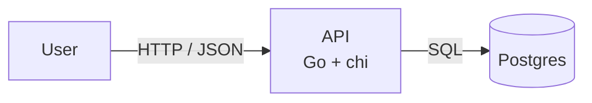
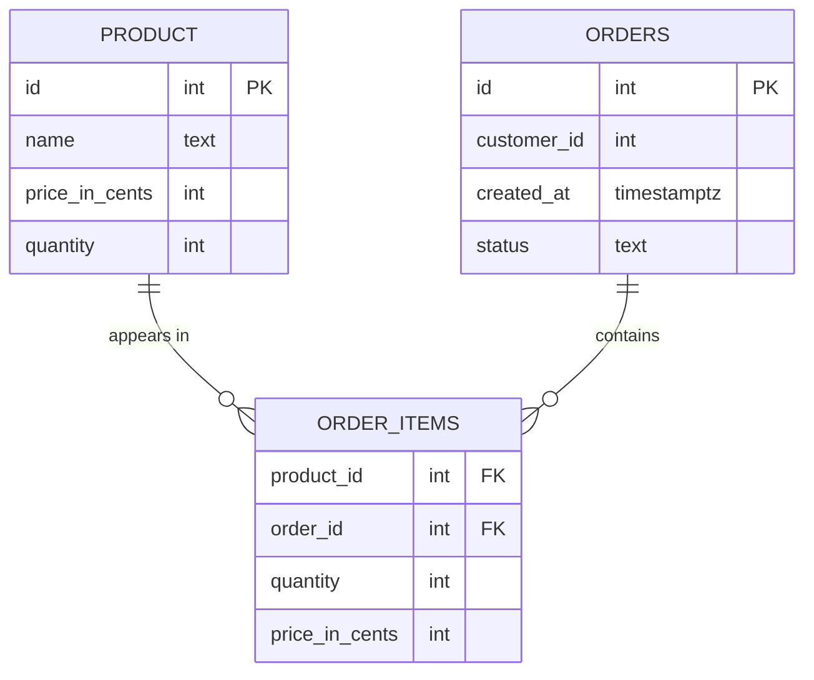

# ecom-go

A production-style e-commerce REST API written in Go.

This is a learning project. I'm picking up Go, and rather than working through
isolated exercises I decided to build something closer to what real backend code
looks like — layered packages, structured logging, sane server timeouts, middleware,
and room for a database and proper domain logic to grow into. The scope is a small
e-commerce backend: products, and eventually carts, orders, and users.

It's a work in progress. Expect pieces to be half-built while I learn my way through
each of them.

## Stack

- **Go 1.24.3**
- **[chi](https://github.com/go-chi/chi)** — HTTP routing and middleware
- **log/slog** — structured logging from the standard library

## Layout

```
cmd/
  main.go          # entrypoint: config, logger, server start
  api.go           # application struct, route mounting, HTTP server setup
internal/
  products/
    handlers.go    # HTTP layer for products
    service.go     # business logic layer for products
```

The split between `cmd` (wiring) and `internal` (domain packages) is deliberate:
handlers stay thin and talk to a service, so the business logic never depends on
the transport layer.

## Architecture



Each request travels the same three layers, and the dependencies only ever point
downward:

```
handler   →  decode + validate the request, write the JSON response
service   →  business rules, transactions, orchestration
store     →  SQL against Postgres, returns domain types
```

The handler never writes SQL and the store never knows about `http`. The service
sits in between and is the only layer that owns a transaction — creating an order
touches multiple tables and has to be all-or-nothing.

### Data model



Two decisions worth calling out:

- **Money is stored as `price_in_cents` integers**, never floats. Float rounding
  on currency is a classic production bug.
- **`order_items` carries its own `price_in_cents`.** It's a copy of the product
  price at the moment of purchase, not a lookup. If the product price changes
  later, historical orders must still total what the customer actually paid.

`orders` holds the header (who, when, what state) and `order_items` holds the
lines — so an order total is a `JOIN` and an aggregate, not a stored column that
can drift out of sync.

## API

Routes are versioned under a `/v1` prefix so the URL space can change later
without breaking existing clients.

| Method | Path | Notes |
| --- | --- | --- |
| `GET` | `/health` | Liveness check |
| `GET` | `/v1/products?name=&limit=20&offset=0` | Filter by name, paginated |
| `POST` | `/v1/orders` | Creates an order and its items in one transaction |

Planned next:

| Method | Path | Notes |
| --- | --- | --- |
| `GET` | `/v1/products/{id}` | Single product |
| `POST` | `/v1/products` | Create a product |
| `GET` | `/v1/orders/{id}` | Order with its items, joined and totalled |

Pagination is `limit`/`offset` with a server-side cap, so an unbounded
`GET /v1/products` can't be used to pull the whole table in one request.

## Running it

```bash
go mod download
go run ./cmd
```

The server listens on `:8080`.

```bash
curl http://localhost:8080/health
# The server is ACTIVE.
```


